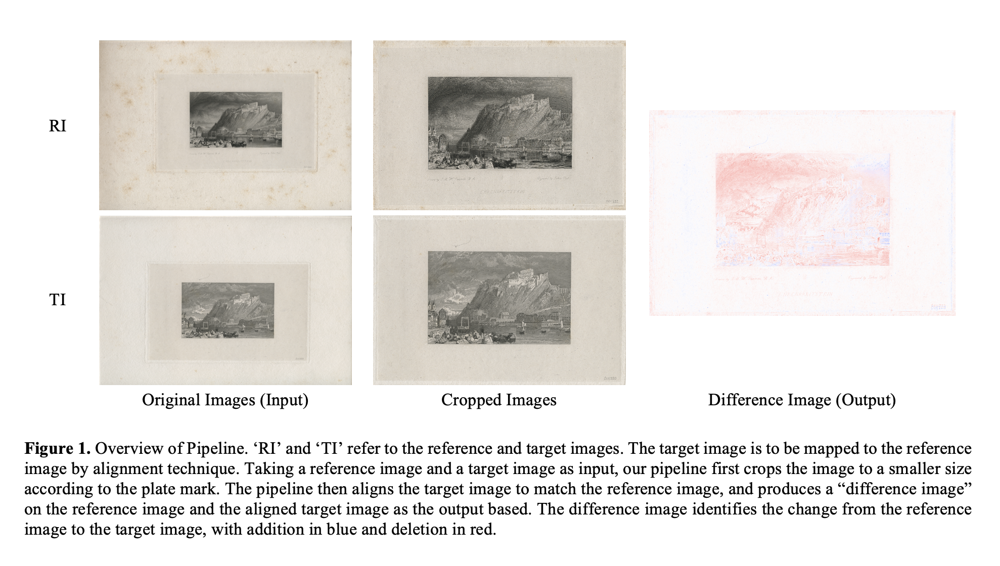

# Identifying differences between very similar images
## Overview



Image alignment plays an important role in accurately comparing or identifying differences or changes in images taken from different viewpoints, time frames, or conditions. This project presents an automated pipeline for identifying changes between different editions of high-resolution Turner's digital prints by a “difference image”. This pipeline works end-to-end, which receives two raw images of Turner’s prints and directly outputs a “difference image” showing the change of addition and deletion in two colors. Here is a Figure to show an example of the pipeline's outputs. 


## Pipeline
The pipeline involves two key components: automatic cropping and alignment. Automatic cropping removes the unexpected elements outside the region of interest and reduces computational time. It is realized by hybrid image segmentation consisting of UNet and floodfill-based refinement. The alignment technique aligns two prints and then produces the change between them. This technique consists of a series of feature engineering techniques, including feature extraction by BRISK, feature matching by Brute Force, match filtering, and homography estimation by RANSAC. 

## Dependency
The code is running on Python 3.8.

## File Structure
* __main.py__ is the file of the main function to run the full pipeline.
* __params.json__ is the configuration file with configuration settings. The descriptions of parameters are available within the file.
* __/AutoCrop/__ is the folder that contains the code for Automatic Cropping
* __/Alignment/__ is the folder that contains the code for Alignment.
* __/MainImage/__ is the folder that contains the images saved as the full pipeline executes.
* __/DATASET/__ is the folder that contains the dataset for UNet training. The inside data can be downloaded at: [UNet Dataset](https://drive.google.com/drive/folders/1mkV8vpoBrAI36g69rmQRIL2s42BZYVRR?usp=sharing)

## How to Run the Full Pipeline?
* Before running the full pipeline, the user should download the pre-trained UNet model and put it in the __AutoCrop__ folder. The pre-trained model is available at: [Pre-trained UNet](https://drive.google.com/file/d/1U3uRodQplDR1FjDXRqcGVgrgoxanDNa-/view?usp=sharing)
* Then the user needs to put a target image and a reference image in the folder __'./MainImage/Original Input/'__.
* In __params.json__, the user needs to modify the relative paths: __main_img1_path__ and __main_img2_path__, where the former refers to the path of the target image and the latter refers to the path of the reference image. Also remember to set the __auto_crop_data_mode__ as __"Defalut"__.
* The command to run the full pipeline is here: 
```python
Python ./AutoCrop/auto_crop_test.py
```
The output images can be found in __'./MainImage/'__.

## How to Train/Test UNet?
* The command to train UNet is here:
```python
Python ./AutoCrop/auto_crop_train_val.py
```

* The command to test UNet is here:
```python
Python ./AutoCrop/auto_crop_test.py
```

## How to Implement Identical Evaluation?
### What is Identical Evaluation?


This project designs an “Identical Evaluation (IE)” to test the performance of the alignment technique. Briefly, IE works by applying random or pre-defined transformations on an image and examining if the alignment technique can restore the transformed image to the original image. In an ideal scenario, the aligned image is identical to the original image. 


### Related Files
* __identical_evaluation_feature_comparison.py__: Experiment with different feature-extracting algorithms. Referring to Experiment ID A1-A5 in the dissertation.
* __identical_evaluation.py__: Single Identical Evaluation experiment on illumination change, affine transformation, perspective transformation, or local distortion.
* __identical_evaluation_scale.py__: Experiment on the influence of "change of image size/scale". Referring to Experiment ID A7 in the dissertation.
* __identical_evaluation_stepsize.py__: Experiment on the influence of "stepsize" of denseSIFT Extractor. Referring to Experiment ID A6 in the dissertation.
* __identical_evaluation_match_threshold.py__: Experiment on the influence of "filtering threshold (FT)". Referring to Experiment ID A9 in the dissertation.
* __identical_evaluation_single_distortion.py__: Experiment on the robustness against Illumination Change or Affine Transformation (Scale, Rotation, Translation). Referring to Experiment ID A10-A15 in the dissertation.

### How to implement
* First, the user needs to put a target image and a reference image in the folder __'./Alignment/input_temp/'__.
* Then, in __params.json__, the user needs to modify the relative paths: __img1_path__ and __img2_path__, where the former refers to the path of the target image and the latter refers to the path of the reference image. The other parameters of the experiment can also be adjusted according to the comments.
* Next, directly execute the corresponding file. For example, if the user wants to test evaluate on "Single Identical Evaluation", the command to run the code is:
```python
Python ./Alignment/identical_evaluation.py
```  
The output images can be found in __'./Alignment/output_temp/'__.

N.B.  When the user wants to implement different types of Identical Evaluation, the __eva_mode__ in __params.py__ should be changed according to the comments.
